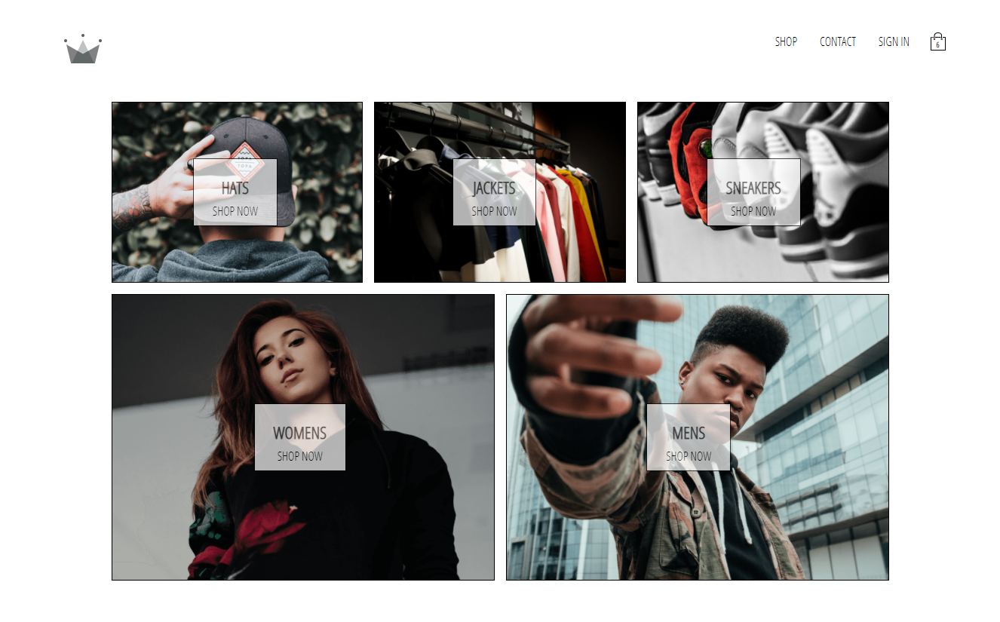
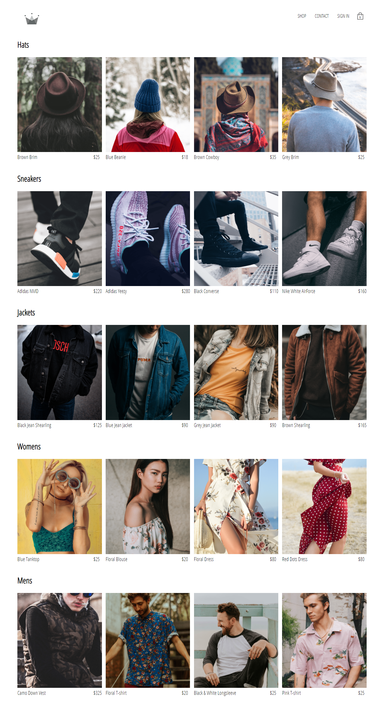

# CRWN CLOTHING 👕👗🥾👒 [[Live Deployment]](https://crwn-react-ecom-live.herokuapp.com)


> An Ecommerce website Built with React Ecosystem technologies and Firebase.

## Installing / Getting started

```shell
git clone https://github.com/Hardly-Human/React-Ecommerce-Store.git
cd React-Ecommerce-Store
npm install
npm start
```

## Features

This Project is Built with a React (Frontend) and Firebase (Backend) for Authentication.

-   Google's Authentication. {All the Data is automatically deleted upon leaving Project Page}
-   Session persistence. {Browser local storage is used to persist data between page renders}
-   Stripe Payment Integration in test mode.

### Packages Used :

-   react @17.0.2
-   react-router-dom @5.2.0
-   redux @4.1.0
-   react-redux @7.2.4
-   redux-logger @3.0.6
-   reselect @4.0.0
-   firebase @8.8.1
-   node-sass @6.0.1
-   redux-persist @6.0.0

## Links

-   Project homepage: https://crwn-react-ecom-live.herokuapp.com
-   Repository: https://github.com/Hardly-Human/React-Ecommerce-Store
-   Issue tracker: https://github.com/Hardly-Human/React-Ecommerce-Store/issues
    -   In case of sensitive bugs like security vulnerabilities, please contact
        rehanuddin1024@gmail.com directly instead of using issue tracker. We value your effort
        to improve the security and privacy of this project!
-   Related projects:
    -   WhatsApp Clone: https://www.iamrehan.me/Whatsapp-clone/
    -   Go Chat Video: https://github.com/Hardly-Human/Go-Chat-Video

#### Demo:




